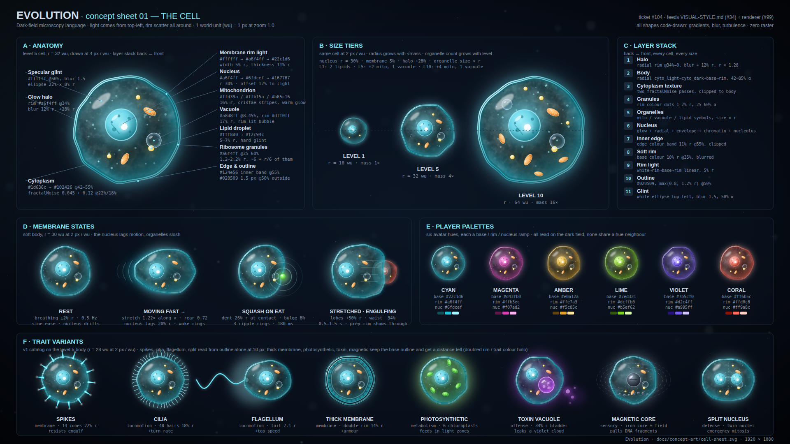
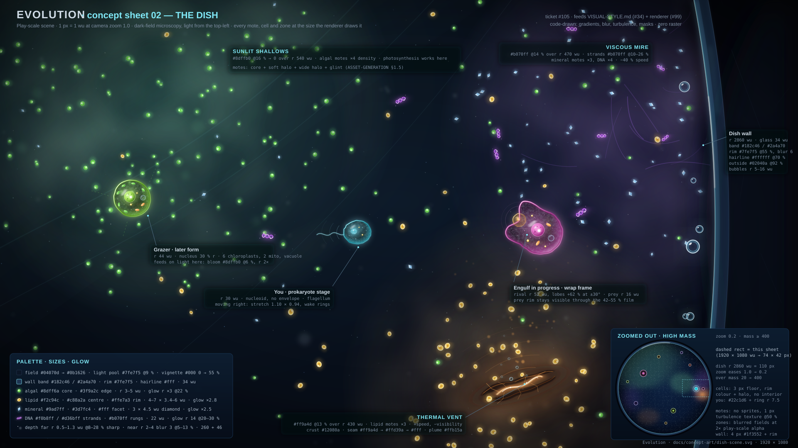
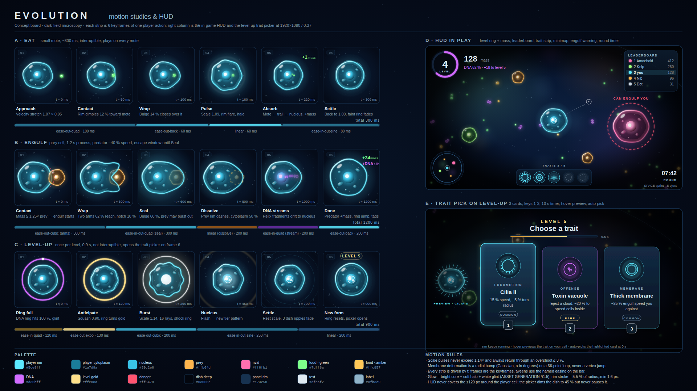
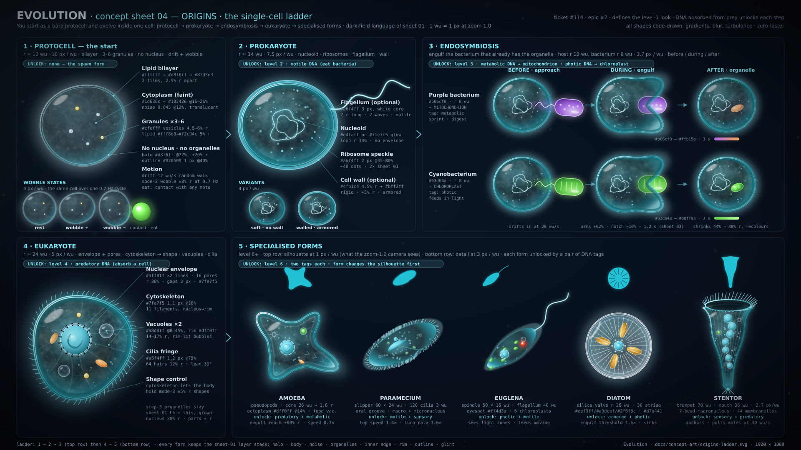

# Concept art

Code-drawn concept sheets for Evolution. Every sheet is a hand-authored SVG (gradients, blur and
turbulence filters, masks, layered shapes, zero raster content) with a 1920 × 1080 PNG render
committed next to it. The SVG is the source of truth. Sheets feed the planned style guide
(`docs/VISUAL-STYLE.md`, #34) and the Pixi renderer (#99). Sizes are in **world units (wu)**: 1 wu = 1 px at camera zoom 1.0. Each
sheet states the px / wu it is drawn at.

**Rendering.** Sheets 01 and 03 are rendered with Playwright's headless Chromium, sheets 02 and 04
with `rsvg-convert`; each PNG in the repo was produced by the command listed for it, so use the
same one when you re-render (the two renderers differ in filter and font rasterisation). Copy the
PNG into the PR's `qa/evidence/` folder as review evidence. Sheet 04's SVG is emitted by the seeded
generator `tools/origins-ladder.py` (run `python3 docs/concept-art/tools/origins-ladder.py` from the
repo root; it rewrites `origins-ladder.svg` byte-for-byte), so edit the script, re-run it, then
re-render; never hand-edit that SVG.

```bash
CHROME="$(ls -d /opt/playwright/chromium-*/chrome-linux64/chrome | tail -1)"
render_chromium() { "$CHROME" --headless=new --no-sandbox --disable-gpu --hide-scrollbars \
  --window-size=1920,1080 --screenshot="docs/concept-art/$1.png" "file://$PWD/docs/concept-art/$1.svg"; }

render_chromium cell-sheet                                                                         # sheet 01
rsvg-convert -w 1920 -h 1080 docs/concept-art/dish-scene.svg -o docs/concept-art/dish-scene.png    # sheet 02
render_chromium motion-and-hud                                                                     # sheet 03
rsvg-convert -w 1920 -h 1080 docs/concept-art/origins-ladder.svg -o docs/concept-art/origins-ladder.png # 04
```

**Who owns what.** Where sheets overlap, one sheet is canonical and the others defer to it:

- **Sheet 01** owns the cell layer stack, the six player palettes, the organelle constants, the dish
  background pair (`BG_DEEP` / `BG_FIELD`) and the algal green (`FOOD_MOTE`).
- **Sheet 02** owns the dish: wall, zones, motes, depth particles, the zoomed-out camera.
- **Sheet 03** owns the action keyframes (eat, engulf, level-up: timings, easing and deformation
  values) and the HUD / trait-picker layout.
- **Sheet 04** owns the level ladder: level 1 is the **protocell** (#22, #114), then prokaryote,
  endosymbiosis, eukaryote and the specialised forms. Sheet 01's size tiers and the player in
  sheet 02 are drawn as eukaryote-era cells and will be revised to start from the protocell in a
  follow-up (no redraw in the sheet PRs).

## Sheet 01 — the cell (`cell-sheet.svg`, #104)



Fixes the cell language: dark-field microscopy, light from the top-left with rim scatter all
around, a translucent layered membrane, textured cytoplasm, a nucleus and four organelle types.

**Panels**

- **A · Anatomy** — level-5 cell (r = 32 wu) at 4 px / wu, every layer annotated with hex + size.
- **B · Size tiers** — the same cell at level 1 / 5 / 10 (r = 16 / 32 / 64 wu, mass 1× / 4× / 16×;
  radius grows with √mass). Organelle count grows with level: L1 two lipid droplets; L5 adds two
  mitochondria and a vacuole; L10 adds four mitochondria and a vacuole. **Follow-up:** these are
  eukaryote-era tiers (level 1 here has a nucleus). Per #22 and sheet 04 the spawn form is the
  protocell (r ≈ 10 wu, no nucleus) and the ladder below it is sheet 04's; the tier table will be
  revised to start from the protocell. Starting radius: sheet 04's r ≈ 10 wu wins over the r = 16
  wu here and the r = 30 wu player in sheet 02, both of which are later forms.
- **C · Layer stack** — the eleven draw layers, back to front, for the renderer to mirror.
- **D · Membrane states** — rest, moving fast, squash on eat, stretched while engulfing (drawn at
  the pre-sheet-03 values; the numbers in the motion table below are canonical).
- **E · Player palettes** — six avatar hues, each a base / rim / nucleus ramp.
- **F · Trait variants** — spikes, cilia, flagellum, thick membrane, photosynthetic pigment,
  toxin vacuole, magnetic core, split nucleus, all on the level-5 body.

**Cell proportions (fractions of cell radius r)**

| Element            | Size                                                              |
| ------------------ | ----------------------------------------------------------------- |
| Glow halo          | r × 1.28, blur ≈ 12 % r, rim colour @34 % → 0                     |
| Membrane thickness | 11 % r inner edge band, 5 % r rim-light stroke                    |
| Outline            | `#020509`, max(0.8 px, 1.2 % r) @50 %                             |
| Nucleus            | 30 % r, offset 12 % r toward the light; nucleolus 22 % of nucleus |
| Mitochondrion      | 16 % r long, 8 % r wide                                           |
| Vacuole            | 17 % r                                                            |
| Lipid droplet      | 5–7 % r                                                           |
| Ribosome granules  | 1.2–2.2 % r, about 6 + r / 6 of them                              |
| Specular glint     | ellipse 22 % × 8 % r at top-left, blur 1.5 px, white @50 %        |

**Membrane motion** (rest and moving are defined here; eat and engulf use sheet 03's keyframes)

| State  | Deformation                                                                                                    |
| ------ | -------------------------------------------------------------------------------------------------------------- |
| Rest   | breathing ±2 % r at 0.5 Hz, sine ease; nucleus drifts slowly                                                   |
| Moving | stretch 1.22× along velocity, rear tapers to 0.72; nucleus lags 20 % r; wake rings and ghost trail behind      |
| Eat    | sheet 03: contact dimple −12 % r (σ 22°), wrap bulge +14 % (σ 30°), pulse 1.09, 300 ms                         |
| Engulf | sheet 03: two lobes +62 % r at ±30° (σ 16°), −10 % notch between, 1200 ms; prey rim stays visible through film |

**Player palettes** (base = membrane body, rim = rim light, nuc = nucleus; darker shades derived
in HSL: edge = 42 % lightness, cyto light = 55 %, cyto dark = 22 % lightness / 55 % saturation)

| Player  | base      | rim       | nuc       | edge      | cyto light | cyto dark | nuc dark  |
| ------- | --------- | --------- | --------- | --------- | ---------- | --------- | --------- |
| Cyan    | `#22c1d6` | `#a6f4ff` | `#6fdcef` | `#124e56` | `#1d636c`  | `#102426` | `#167787` |
| Magenta | `#d43fb0` | `#ffb3ec` | `#f07ad2` | `#5b194b` | `#72255f`  | `#291424` | `#8c176e` |
| Amber   | `#e0a12a` | `#ffe7a3` | `#f5c85c` | `#5d4312` | `#75571d`  | `#292111` | `#88650f` |
| Lime    | `#7ed321` | `#dcffb0` | `#b5ef62` | `#355512` | `#456a1c`  | `#1b2610` | `#568314` |
| Violet  | `#7b5cf0` | `#d2c4ff` | `#a995ff` | `#27127a` | `#381f98`  | `#1b1435` | `#2809ad` |
| Coral   | `#ff6b5c` | `#ffd0c8` | `#ff9a8c` | `#8a1307` | `#ac2113`  | `#3b1511` | `#a91c09` |

**Shared organelle and environment colours**

| Constant                     | Hex                               |
| ---------------------------- | --------------------------------- |
| `BG_DEEP` / `BG_FIELD`       | `#04070d` / `#0b1626`             |
| `MITO_LIGHT / BASE / DARK`   | `#ffd39a` / `#ffb15a` / `#b85c16` |
| `VAC_BASE / VAC_RIM`         | `#a8d8ff` (8–45 %) / `#dff0ff`    |
| `LIPID_LIGHT / LIPID_BASE`   | `#fff8d0` / `#f2c94c`             |
| `CHLORO_LIGHT / BASE / DARK` | `#b8ff9a` / `#63d64a` / `#1f7a2b` |
| `TOXIN_BASE / RIM / GLOW`    | `#a338e0` / `#f0b8ff` / `#d05cff` |
| `MAGNET_LIGHT / BASE / DARK` | `#9fb0c4` / `#4a5866` / `#141a22` |
| `FOOD_MOTE`                  | `#8dff6a`                         |
| Sheet text / muted / accent  | `#cfdbe6` / `#7d8da1` / `#7fe7f5` |

**Trait legibility (panel F)**

- Four traits change the silhouette — spikes, cilia, flagellum, split nucleus — and read from the
  outline alone at 10 px on screen.
- The other four — thick membrane, photosynthetic, toxin vacuole, magnetic core — keep the base
  outline and read by interior colour, so each carries a **distance tell** the renderer must draw:
  thick membrane doubles the rim (a 2.6 px `#020509` outline plus a `#a6f4ff` hairline at 1.075 r
  and a second dark line at 1.095 r); the other three swap the cyan glow halo for a trait-colour
  halo at 1.39 r (`CHLORO_LIGHT`, `TOXIN_GLOW`, `MAGNET_LIGHT` @42 % → 0).

**Design decisions**

- Dark-field means the whole rim scatters light: the rim stroke is a white → rim → base → rim
  gradient so the top-left is brightest but the far side never goes dark.
- The body gradient is translucent (42–85 % alpha) so the dish shows through; volume comes from a
  blurred dark ellipse at the bottom-right and a light pool at the top-left, not from opacity.
- Organelles are warm (mitochondria, lipids) against a cool membrane so the interior reads as
  alive at any palette; only chloroplasts, toxin and the magnetic core recolour the interior.
- Six palettes are spaced around the hue wheel with no two neighbours adjacent, and each keeps
  the same lightness ramp so every player cell has identical contrast against the dark field.

## Sheet 02 — the dish (`dish-scene.svg`, #105)



A play-scale scene at **1 px / wu, camera zoom 1.0**: the dish wall, three ecology zones, the
three nutrient mote types, DNA fragments, depth particles and a vignette, with four cells (the
player, a rival mid-engulf, its prey and a larger grazer in the shallows). The inset at the bottom
right is the same dish zoomed out at high mass.

**Draw order (back → front)** — the renderer mirrors this list.

1. Field: radial `#0b1626` → `#04070d`, a condenser light pool (`#7fe7f5` 9 % → 0, ellipse
   980 × 760 wu centred top-left) and three faint caustic arcs at 5 %.
2. Zones: a radial tint per zone plus a fractal-noise cloud (base frequency 0.003–0.004, three
   octaves) masked to the zone disc so the edge is organic, never a hard circle.
3. Zone features: mire filaments, the vent fissure and its rising plume.
4. Far depth particles (sharp), then motes, then DNA fragments.
5. Cells, prey first so the predator's translucent film shows it.
6. Near depth particles (blurred) and bokeh discs.
7. Dish wall and its bubbles, then the vignette (`#000` 0 → 55 %, radius 72 %).
8. Annotations, never inside the play area in-game.

**Dish wall** (circle r = 2860 wu; the view sits against the right-hand wall)

| Layer            | Value                                                          |
| ---------------- | -------------------------------------------------------------- |
| Outside the dish | `#02040a` @92 %, faint stage scratches `#2a3d58` @25–35 %      |
| Inner shadow     | `#000` 26 wu @35 %, blur 10, just inside the wall              |
| Glass band       | 34 wu: `#182c46` body, `#2a4a70` inner 12 wu, `#4a6a90` outer  |
| Rim scatter      | `#7fe7f5` 2.5 wu @55 % + 9 wu blur 6 @28 %                     |
| Hairline         | `#ffffff` 1 wu @70 % on the inner edge                         |
| Specular streak  | `#ffffff` 2.2 wu @90 %, 220 wu long, 7° → 2.6° above the light |
| Bubbles          | r 5–16 wu, cling 14–70 wu inside the wall, rim-lit, one glint  |

**Ecology zones** (radial tint at the centre → 0 at the radius; cloud at 32–40 %)

| Zone            | Tint      | Alpha | Radius | Motes              | Extras                                  |
| --------------- | --------- | ----- | ------ | ------------------ | --------------------------------------- |
| Sunlit shallows | `#8dffb0` | 16 %  | 540 wu | algal ×4 density   | photosynthesis works here               |
| Thermal vent    | `#ff9a4d` | 13 %  | 430 wu | lipid ×3           | fissure (below), plume `#ffb15a`        |
| Viscous mire    | `#b070ff` | 14 %  | 470 wu | mineral ×3, DNA ×4 | strands `#b070ff` @10–26 %, −40 % speed |

Base mote density outside any zone is 5 % of the zone peak, so no part of the dish is empty.

**Vent fissure** (back → front, 190 × 60 wu, rotated −18°)

| Layer        | Value                                                                           |
| ------------ | ------------------------------------------------------------------------------- |
| Heat pool    | `#ff9a4d` @20 % blur 40 (170 × 80 wu) + hot column `#ffb15a` @10 % rising 120   |
| Crust        | two basalt plates `#12080a` @72 % blur 1.5 over a blur-16 shadow @50 %          |
| Crust rim    | `#7a3d12` 1.2 wu @70 % on the seam side, `#ffb15a` 0.8 wu @45 % where it glows  |
| Hairline     | 7 branching cracks `#ffb15a` 0.9–1.1 wu @35–50 %, fading away from the seam     |
| Molten seam  | `#ff9a4d` 9 wu blur 6 @55 % → `#ffd39a` 3.2 wu blur 1.5 → `#ffffff` 1.1 wu core |
| Heat shimmer | 4 refraction arcs `#ffb15a` 1–1.3 wu, 20 % → 5 % climbing 30–120 wu             |
| Vent bubbles | 8 rim-lit bubbles, r 2–4.2 wu, shrinking and fading 100 % → 40 % as they rise   |

The two hottest points on the seam get a 1.3–1.6 wu white glint; in-game they flicker at 6–9 Hz.

**Nutrient motes and DNA** (every glow is core + soft halo + wide halo + glint)

| Item         | Core / edge / rim                                           | Size                      | Glow                                  |
| ------------ | ----------------------------------------------------------- | ------------------------- | ------------------------------------- |
| Algal mote   | `#8dff6a` / `#3f9a2c` / `#dcffb0`                           | r 3–5 wu (circle)         | soft r ×1.6 @30 %, wide r ×3 @22 %    |
| Lipid mote   | `#f2c94c`, centre `#c88a2a`, rim `#ffe7a3`, glint `#fff8d0` | 4–7 × 3.4–6 wu (ellipse)  | soft ×1.4 @30 %, wide ×2.8 @20 %      |
| Mineral mote | `#ffffff` → `#9ad7ff` → `#3d7fc4`, facet `#e6f6ff`          | 3 × 4.5 wu (diamond)      | soft ×1.4 @32 %, wide ×2.5 @22 %      |
| DNA fragment | strands `#f0b8ff` / `#d36bff`, rungs `#b070ff`              | 22 wu long, 9 wu tall     | r 14 @20 % blur 6 + r 12 @30 % blur 3 |
| Depth, far   | `#ffffff` `#c4f0ff` `#9fe8f5` `#7fb8ff`                     | r 0.5–1.3 wu, 260 of them | none, sharp, 8–28 %                   |
| Depth, near  | `#dff4ff`                                                   | r 2.2–4.4 wu, 46 of them  | blur 3, 5–13 %                        |
| Bokeh        | zone colour                                                 | r 6–14 wu, 12 of them     | blur 6, 5–11 % + ring                 |

Motes are rotated and scaled 0.7–1.5× at random (seeded) so a field never tiles. Silhouettes
differ on purpose: circle, oily ellipse, diamond — readable at 3 wu without colour.

**Cells in the scene** (sheet 01 layer stack and palettes)

| Cell   | Palette | r     | Notes                                                                                                                                                                                                                            |
| ------ | ------- | ----- | -------------------------------------------------------------------------------------------------------------------------------------------------------------------------------------------------------------------------------- |
| Player | Cyan    | 30 wu | prokaryote stage: diffuse nucleoid (`#6fdcef` @40–55 %, no envelope) lagging 20 % r, two lipids, a flagellum `#a6f4ff` 1.2 wu, moving right at stretch 1.10 × 0.94 with three wake arcs                                          |
| Rival  | Magenta | 52 wu | eukaryote: nucleus 30 % r, 2 mitochondria, vacuole, 3 lipids; engulf **wrap frame**: lobes +62 % at 180° / 240° (σ 16°), notch −10 % between                                                                                     |
| Prey   | Amber   | 16 wu | drawn under the rival's film; a faint amber body (`#e0a12a` @22 %), its rim (1.4 wu) and nucleus glint are redrawn on top at 62 % so it stays visible; escape-window readability is tuned at runtime                             |
| Grazer | Lime    | 44 wu | later form resting in the shallows: nucleus 30 % r, 6 chloroplasts (`#8dff6a` / `#2f7a22`, 12.6 wu) on the lit edge, 2 mito, vacuole; light-harvest bloom `#8dffb0` @6 % at r 2×, algal motes drift in on dashed `#8dff6a` lines |

The cytoplasm texture is the sheet-01 fractal noise at 4× the frequency (0.18 / 0.45) because
this sheet is drawn at 1 px / wu instead of 4.

The player is the smallest thing with a rim in the scene on purpose: everything larger around it
is a later form, which is the progression the game promises. Its radius (30 wu) predates sheet
04's ladder and will follow the size-tier revision noted under sheet 01.

Membranes are 36-point Catmull-Rom loops: radius = r × (1 + Σ Gaussian bumps of ±2.5–4 %, σ 0.25–0.4
rad) plus ±0.8 % seeded jitter, converted to cubic Béziers (tangent = ⅙ of the chord to the
neighbours). The engulf wrap frame adds two +62 % lobes (σ 16°) and a −10 % notch between them.

**Zoomed-out inset (high mass)**

- Camera zoom eases 1.0 → 0.2 as mass goes 20 → 400; at 0.2 the whole dish (r 2860 wu = 110 px)
  fits on screen. The dashed rectangle is this sheet's view (1920 × 1080 wu → 74 × 42 px), placed
  to scale: world (x, y) maps to inset (1598, 936) + (x + 1140, y − 540) × 110 / 2860, so the
  three zones and the vent of this sheet fall inside it (the vent at inset (1690, 951)); the
  fainter fields elsewhere in the dish are other zones.
- Cells collapse to a rim-coloured dot with a 3 px floor and a halo, no interior. The player
  keeps `#22c1d6` with a `#a6f4ff` ring at r 7.5 px.
- Motes are not drawn as sprites: a 1 px turbulence texture at 50 % stands in for the field.
- Zones become blurred colour fields at twice the play-scale alpha; the wall is a 4 px
  `#1f3552` band with the same rim scatter.

**Design decisions**

- Zones are read by mote colour and density first, tint second: the tints stay ≤ 16 % so the
  cells' palettes keep their contrast everywhere in the dish.
- Motes glow at 2.5–3× their radius so a field reads as a luminous cloud at zoom 0.5 and still
  resolves into individual pick-ups at zoom 1.0.
- The dish wall is the only hard edge in the world: it gets the brightest hairline in the scene
  and bubbles cling to it so the boundary is unmistakable at every zoom.
- Depth comes from three particle layers (far sharp, near blurred, bokeh) and the vignette, not
  from darkening the field, so the dark-field background stays uniform for cell contrast.
- Annotation panels use `#0e1f33` → `#060e1a` @88 % with a `#173250` rim, and callouts sit on a
  `#04070d` @62 % blurred backing so text never fights a mote. The inset panel sits over the dish
  wall, so it gets an opaque `#04070d` backing under the gradient: the wall glow never shows
  through a panel.

## Sheet 03 — motion studies and HUD (`motion-and-hud.svg`, #106)



1920 × 1080 board. Left column: three 6-keyframe strips for the player actions; right column: the
in-game HUD and the level-up trait picker composed over a play-scale dish scene at 0.37 scale.

### Strips (keyframes, easing, durations)

| Strip                                            | Total   | Keyframes (t)                                                                      | Easing per tween                                                                              |
| ------------------------------------------------ | ------- | ---------------------------------------------------------------------------------- | --------------------------------------------------------------------------------------------- |
| **A · Eat** (small mote, interruptible)          | 300 ms  | approach 0 → contact 50 → wrap 100 → pulse 160 → absorb 220 → settle 300           | ease-out-quad 100 · ease-out-back 60 · linear 60 · ease-in-out-sine 80                        |
| **B · Engulf** (prey cell, predator −40 % speed) | 1200 ms | contact 0 → wrap 300 → seal 600 → dissolve 800 → DNA streams 1000 → done 1200      | ease-out-cubic 300 · ease-in-out-quad 300 · linear 200 · ease-in-quad 200 · ease-out-back 200 |
| **C · Level-up** (not interruptible)             | 900 ms  | ring full 0 → anticipate 120 → burst 250 → nucleus 450 → settle 700 → new form 900 | ease-in-quad 120 · ease-out-expo 130 · ease-out-cubic 200 · ease-in-out-sine 250 · linear 200 |

Membrane deformation values (fraction of the cell radius `R`); these are the canonical eat and
engulf numbers, sheets 01, 02 and 04 defer to them:

- Eat: velocity stretch 1.07 × 0.95; contact dimple −12 % (σ 22°); wrap bulge +14 % (σ 30°);
  pulse scale 1.09 with a halo at 1.5 R; settle returns to 1.00 through a ring at 1.5 R.
- Engulf: two pseudopod arms +62 % at ±30° (σ 16°) with a −10 % notch between them; seal bulge
  +60 % (σ 42°) relaxing 0.60 → 0.42 → 0.22; prey rim becomes a `5 6` dash and its cytoplasm
  drops to 50 % before three helix fragments stream into the nucleus. The prey is drawn _under_
  the predator membrane from the wrap frame on, so the translucent cytoplasm shows it inside.
  The escape window closes at the seal frame.
- Level-up: anticipation squash 0.90, burst scale 1.14 with 16 rays (1.2 R → 1.95 R) and a white
  shock ring at 1.6 R, nucleus flash then the tier-2 nucleus pattern (inner ring + two lobes),
  three dish ripples at 1.7 / 2.1 / 2.5 R, then the DNA ring resets and the picker opens.

### HUD (panel D)

- Top-left: level ring radius 34 (5 px stroke, `#d36bff` on `#132238` track) around the level
  number, mass readout next to it, DNA percentage line under it.
- Top-right: leaderboard 146 × 112, five rows with player swatches, own row tinted `#5ce9ff` 12 %.
- Bottom-left: minimap radius 46 with dish edge, zone tints and cell dots.
- Bottom-centre: trait strip, five 32 px slots (empty slots dashed), label above the panel.
- Bottom-right: round timer and the two key hints.
- Engulf warning: `#ff5470` dashed circle (6 5) at 64 px around any cell that can engulf you.
- Nothing is drawn within ±120 px of the player cell.

### Trait picker (panel E)

The dish dims to 45 % brightness (a 55 % black overlay) but keeps simulating; three 152 × 226
cards (rounded 14) with a 68 px icon medallion, category, name, two-line effect, rarity chip and a
key chip `1` `2` `3` under each. The highlighted card (Cilia II on the board) lifts 10 px and glows
in its accent colour; the player cell stays visible left of the cards with the highlighted trait
previewed on it, so hover, highlight and preview are always the same card. A 10 s gold timer bar
sits under the title; at 0 s the highlighted card is auto-picked.

### Palette

Cell colours (rim, cytoplasm, nucleus, the prey and rival ramps), the dish background pair and the
algal green are sheet 01's constants (`BG_DEEP` / `BG_FIELD` = `#04070d` / `#0b1626`, `FOOD_MOTE`
`#8dff6a`, Cyan `#22c1d6` / `#a6f4ff` / `#6fdcef`). The board is painted with earlier stand-in
values (`#5ce9ff` rim, `#03060e` / `#071224` field, `#7dff8a` green); it is not repainted because
sheet 01 is what ships. This sheet adds only the roles below.

| Role       | Hex                        | Role                 | Hex                                                                |
| ---------- | -------------------------- | -------------------- | ------------------------------------------------------------------ |
| DNA        | `#d36bff` (deep `#6b2ea6`) | level gold           | `#ffe08a`                                                          |
| danger     | `#ff5470`                  | food · amber         | `#ffc857` board stand-in; lipid motes ship as sheet 02's `#f2c94c` |
| panel rim  | `#173250`                  | text / label / muted | `#dfeaf2` / `#8fb3c9` / `#7f93a8`                                  |
| card frame | accent @45 %, hot @90 %    | timer bar            | `#ffe08a` on `#0b1a2c`                                             |

### Strip cell

The cell in the strips is a **simplified stand-in** so the keyframes read at strip scale: halo at
1.55 R, cytoplasm radial gradient, clipped inner rim, five generic organelles, cytoplasm specks,
nucleus halo + nucleus + highlight, bright rim stroke (5.5 % of R, min 1.6 px, soft glow),
hairline white rim, glint. Sheet 01's eleven-layer stack (halo 1.28 r, mitochondria / vacuole /
lipids / granules, two-pass fractal-noise cytoplasm) is what ships; only the deformation numbers
transfer. Motes are core + soft halo + wide halo + glint. Membranes are 36-point Catmull-Rom loops
with Gaussian radial bumps, so the same numbers transfer directly to a Pixi `Graphics` soft body.

## Sheet 04 — origins, the single-cell ladder (`origins-ladder.svg`, #114)



Defines the **level-1 look**: the player spawns as a bare protocell and evolves inside one cell.
The sheet reads left → right, top row then bottom row: protocell → prokaryote → endosymbiosis →
eukaryote → specialised forms. Every step keeps the sheet-01 layer stack (halo, body, noise,
organelles, inner edge, rim, outline, glint); the size tiers in sheet 01 are revised to start
from the protocell in a follow-up.

**The ladder** — what the player has at each step and which DNA unlocks it (DNA is absorbed from
prey; a _tag_ is the DNA family the prey carries)

| Step | Form              | Radius       | Drawn at    | Unlock                                                                | What changes                                                                                        |
| ---- | ----------------- | ------------ | ----------- | --------------------------------------------------------------------- | --------------------------------------------------------------------------------------------------- |
| 1    | Protocell         | r ≈ 10 wu    | 10 px / wu  | none — the spawn form                                                 | lipid bilayer, faint cytoplasm, 3–6 granules, no nucleus; drifts and wobbles; eats motes by contact |
| 2    | Prokaryote        | r ≈ 14 wu    | 7.5 px / wu | level 2 · **motile** DNA (eat bacteria)                               | nucleoid loop, ribosome speckle; optional flagellum (motile) and rigid cell wall (armored)          |
| 3    | Endosymbiosis     | host r 18 wu | 3.7 px / wu | level 3 · **metabolic** DNA → mitochondrion, **photic** → chloroplast | engulf a purple bacterium (becomes a mitochondrion) or a cyanobacterium (becomes a chloroplast)     |
| 4    | Eukaryote         | r ≈ 24 wu    | 5 px / wu   | level 4 · **predatory** DNA (absorb a whole cell)                     | nuclear envelope with pores, cytoskeleton (shape control), vacuoles, cilia fringe                   |
| 5    | Specialised forms | 26–70 wu     | 3 px / wu   | level 6+ · a pair of tags per form (below)                            | the silhouette changes first so each form reads at 1 px / wu                                        |

**Specialised forms** (top row of panel 5 is the 1 px / wu silhouette the zoom-1.0 camera sees;
bottom row is the 3 px / wu detail, stentor at 2.7 px / wu because the trumpet is 70 wu tall)

| Form       | Size                     | Unlock (two tags)     | Signature parts                                                                                            |
| ---------- | ------------------------ | --------------------- | ---------------------------------------------------------------------------------------------------------- |
| Amoeba     | core 26 wu → 1.6 r lobes | predatory + metabolic | pseudopods, ectoplasm rim `#dff0ff` @14 %, food vacuole; engulf reach +60 % r, speed 0.7×                  |
| Paramecium | slipper 60 × 24 wu       | motile + sensory      | 120 cilia 3 wu, oral groove, macro + micronucleus; top speed 1.4×, turn rate 1.6×                          |
| Euglena    | spindle 50 × 16 wu       | photic + motile       | flagellum 40 wu, eyespot `#ff4d3a`, 6 chloroplasts; sees light zones, feeds while moving                   |
| Diatom     | silica valve r 26 wu     | armored + photic      | 36 striae shell `#eef9ff` / `#a9dcef` / `#2f6f8c`, golden plastids `#d7a441`; engulf threshold 1.6×, sinks |
| Stentor    | trumpet 70 wu, mouth 36  | sensory + predatory   | 7-bead macronucleus, 44 membranelles; anchors, pulls motes at 40 wu/s                                      |

**Sheet 04 colour constants** (the cyan player palette, organelle and environment constants are
the sheet-01 values above)

| Constant                            | Hex                                                                      |
| ----------------------------------- | ------------------------------------------------------------------------ |
| `PROTO_FILM` / `PROTO_FILM_LIGHT`   | `#8fd3e3` / `#d8f6ff` (bilayer, 2 films 2.5 % r apart)                   |
| `PROTO_GRANULE`                     | `#cfefff` (vesicles 4.5–6 % r; lipid droplets use `LIPID_*` 5 % r)       |
| `NUCLEOID_STRAND` / `NUCLEOID_GLOW` | `#e4faff` / `#7fe7f5` (loop r 34 %, no envelope)                         |
| `RIBOSOME`                          | `#a6f4ff` (2 px @35–80 %, ~40 dots)                                      |
| `CELL_WALL` / `CELL_WALL_LIGHT`     | `#4fb1c4` / `#bff2ff` (4.5 % r rigid band, +5 % r)                       |
| `FLAGELLUM`                         | `#a6f4ff` 3 px with a white core, 2 r long, 2 waves                      |
| `PURPLE_LIGHT / BASE / DARK / HALO` | `#ead7ff` / `#b06cf0` / `#4d1f8f` / `#d9b8ff` (purple bacterium, r 8 wu) |
| mitochondrion recolour ramp         | `#b06cf0` → `#ffb15a` over 3 s after engulfing                           |
| chloroplast recolour ramp           | `#63d64a` → `#b8ff9a` over 3 s after engulfing                           |
| `ENVELOPE` / `PORE`                 | `#dff8ff` ×2 lines / `#7fe7f5`, 16 pores, gaps 3 px                      |
| `CYTOSKELETON`                      | `#7fe7f5` 1.1 px @28 %, 11 filaments nucleus → rim                       |
| `CILIA`                             | `#a6f4ff` 1.2 px @75 %, 64 hairs 12 % r, lean 30°                        |
| `SILICA_LIGHT / BASE / DARK`        | `#eef9ff` / `#a9dcef` / `#2f6f8c`                                        |
| `DIATOM_PLASTID_LIGHT / DARK`       | `#d7a441` / `#8a5e14`                                                    |
| `EYESPOT` / `EYESPOT_RIM`           | `#ff4d3a` / `#ffb59e`                                                    |
| `SILHOUETTE`                        | `#22c1d6` (1 px / wu camera silhouettes)                                 |
| Panel / panel stroke                | `#0a1422` @45 % / `#1a2a3b`                                              |

**Motion** (level 1 and 2)

| State           | Rule                                                                                                                                                                                    |
| --------------- | --------------------------------------------------------------------------------------------------------------------------------------------------------------------------------------- |
| Protocell drift | random walk at 12 wu/s; mode-2 wobble ±8 % r at 0.7 Hz (rest / wobble + / wobble −)                                                                                                     |
| Protocell eat   | contact with any food mote                                                                                                                                                              |
| Bacterium prey  | drifts in at 20 wu/s; the host engulfs it with sheet 03's wrap frame (arms +62 % at ±30°, σ 16°; notch −10 %; 1200 ms); the film over the engulfed half fades in along x (no hard edge) |
| Organelle birth | the engulfed bacterium shrinks 44 % → 30 % r and recolours along its ramp in 3 s                                                                                                        |

**Design decisions**

- The protocell is deliberately _emptier_ than sheet 01's level 1: body alpha 16–26 % instead of
  42–55 %, a double film instead of the rim-light stack, granules instead of organelles. The
  player must feel the first nucleus arrive.
- The nucleoid is a loose loop drawn with a glow strand, never a filled disc, so the difference
  between prokaryote (step 2) and eukaryote (step 4) is a silhouette difference, not a colour.
- Endosymbiosis keeps the prey's hue through the engulf (purple / green stays visible under the
  host film) and only recolours once it is inside; the purple → amber ramp is what tells the
  player a mitochondrion was born rather than a meal digested.
- Specialised forms change the silhouette first (pseudopods, slipper, spindle, disc, trumpet) so
  they read at 1 px / wu, then add interior detail; the stentor is the only form drawn at a
  smaller scale on the sheet because its 70 wu height is the tallest thing in the game.
- Unlock tags are DNA families (motile, metabolic, photic, predatory, sensory, armored); every
  step 5 form needs two, so no single prey type unlocks a whole body plan.
